# Welcome to your Expo app 👋

This is an [Expo](https://expo.dev) project created with [`create-expo-app`](https://www.npmjs.com/package/create-expo-app).

## Get started

1. Install dependencies

   ```bash
   npm install
   ```

2. Start the app

   ```bash
   npx expo start
   ```

In the output, you'll find options to open the app in a

- [development build](https://docs.expo.dev/develop/development-builds/introduction/)
- [Android emulator](https://docs.expo.dev/workflow/android-studio-emulator/)
- [iOS simulator](https://docs.expo.dev/workflow/ios-simulator/)
- [Expo Go](https://expo.dev/go), a limited sandbox for trying out app development with Expo

You can start developing by editing the files inside the **app** directory. This project uses [file-based routing](https://docs.expo.dev/router/introduction).

## Get a fresh project

When you're ready, run:

```bash
npm run reset-project
```

This command will move the starter code to the **app-example** directory and create a blank **app** directory where you can start developing.

## Learn more

To learn more about developing your project with Expo, look at the following resources:

- [Expo documentation](https://docs.expo.dev/): Learn fundamentals, or go into advanced topics with our [guides](https://docs.expo.dev/guides).
- [Learn Expo tutorial](https://docs.expo.dev/tutorial/introduction/): Follow a step-by-step tutorial where you'll create a project that runs on Android, iOS, and the web.

## Join the community

Join our community of developers creating universal apps.

- [Expo on GitHub](https://github.com/expo/expo): View our open source platform and contribute.
- [Discord community](https://chat.expo.dev): Chat with Expo users and ask questions.

# Ecommerce Application (Frontend)

## Deskripsi
Aplikasi mobile ecommerce modern berbasis React Native & Expo, dirancang untuk pengalaman belanja yang intuitif dan responsif. Fitur utama meliputi browsing produk, manajemen keranjang, wishlist, autentikasi, dan checkout.

## Fitur Utama
- Autentikasi (Login, Signup, Lupa Password)
- Navigasi tab: Home, Shop, Bag, Favorites, Profile
- Browsing produk dengan filter, kategori, dan pencarian
- Detail produk lengkap: gambar, deskripsi, rating, pilihan size & warna
- Keranjang belanja (Bag) dan wishlist (Favorites)
- Checkout dan manajemen pesanan
- Profil pengguna: info, alamat, metode pembayaran, ulasan, pengaturan
- UI modern, responsif, dan mirip aplikasi ecommerce populer

## Teknologi
- React Native
- Expo Router
- Context API (state global)
- AsyncStorage (persistensi data)
- @expo/vector-icons (icon)
- expo-linear-gradient (efek gradien)

## Struktur Folder
```
frontend/
├── app/
│   ├── _layout.tsx
│   ├── (tabs)/home.tsx
│   ├── (tabs)/shop.tsx
│   ├── (tabs)/bag.tsx
│   ├── (tabs)/favorites.tsx
│   ├── (tabs)/profile.tsx
│   ├── (auth)/login.tsx
│   ├── (auth)/signup.tsx
│   ├── (auth)/forgot-password.tsx
│   └── product/[id].tsx
├── assets/
│   ├── images/
│   ├── icons/
│   └── fonts/
├── components/
│   ├── CustomButton.tsx
│   ├── InputField.tsx
│   ├── ProductCard.tsx
│   └── SocialButton.tsx
├── contexts/
│   └── AuthContext.tsx
├── package.json
├── tsconfig.json
└── README.md
```

## Instalasi & Menjalankan
1. Clone repo:
   ```bash
   git clone https://github.com/friedchickenn/ecommerce-application.git
   cd ecommerce-application/frontend
   ```
2. Install dependencies:
   ```bash
   npm install
   ```
3. Jalankan aplikasi:
   ```bash
   npx expo start
   ```
4. Scan QR code dengan Expo Go di perangkat Anda.

## Instruksi Penggunaan
- Login/signup untuk mengakses fitur utama
- Navigasi antar tab: Home, Shop, Bag, Favorites, Profile
- Cari dan filter produk di tab Shop
- Klik produk untuk melihat detail, pilih size/warna, dan tambahkan ke keranjang
- Kelola keranjang dan wishlist
- Lakukan checkout dan lihat riwayat pesanan di Profile

## Penjelasan Setiap Halaman Serta Hasil ScreenShot

### Login
Halaman untuk masuk ke aplikasi. Pengguna memasukkan email dan password, serta dapat memilih login dengan sosial media.
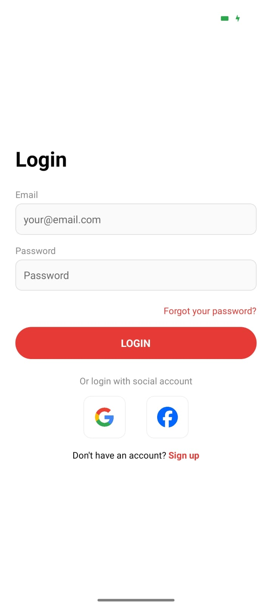

### Signup
Halaman pendaftaran akun baru. Pengguna mengisi data diri, email, dan password untuk membuat akun baru.
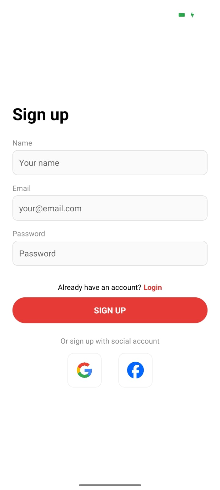

### Forgot Password
Halaman untuk mengatur ulang password jika pengguna lupa. Cukup masukkan email, instruksi reset akan dikirimkan.
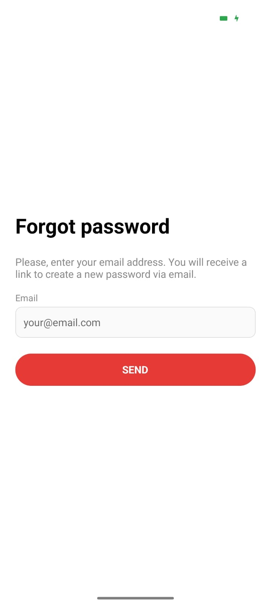

### Home
Halaman utama berisi banner, kategori, dan produk rekomendasi. Pengguna dapat langsung melihat promo dan produk unggulan.
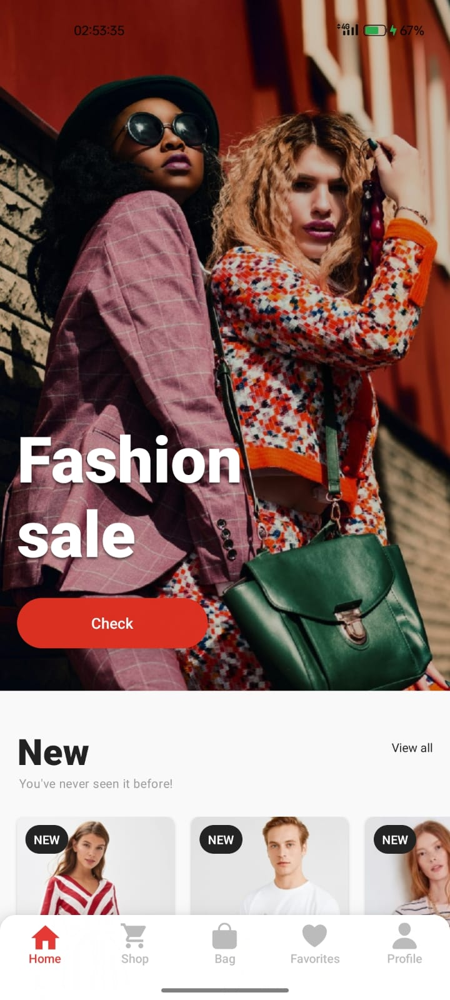 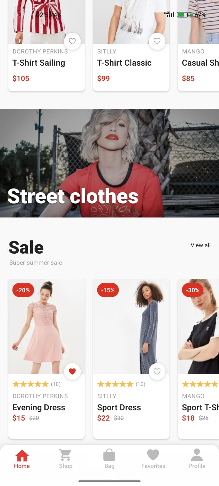 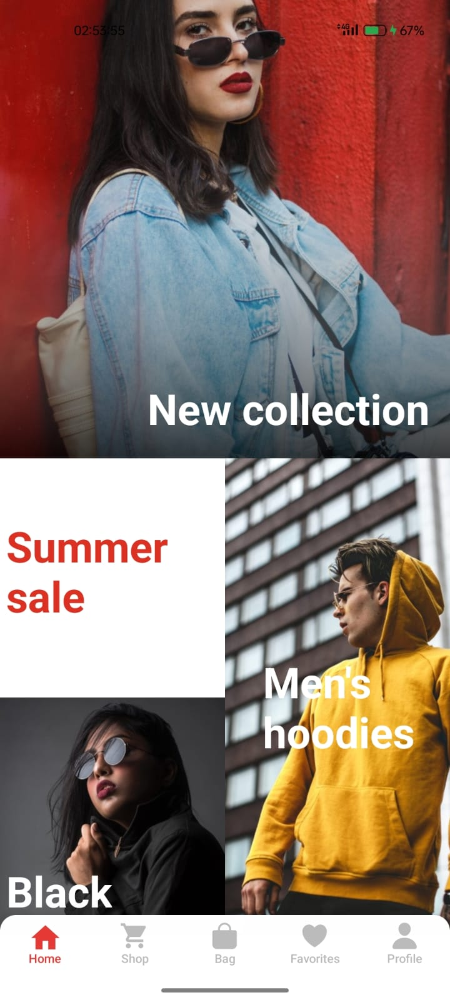

### Shop
Menampilkan daftar produk, filter kategori, pencarian, dan sorting. Pengguna dapat mencari produk, memilih kategori, dan mengurutkan hasil sesuai kebutuhan.
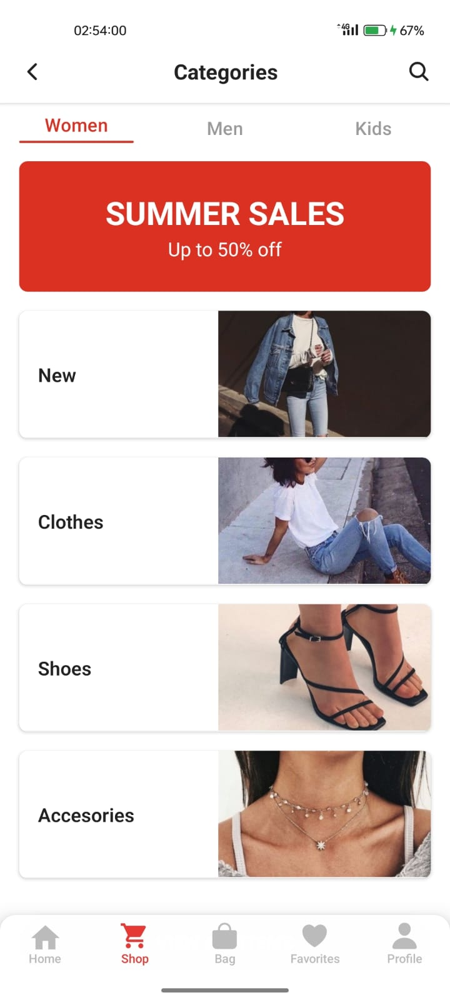 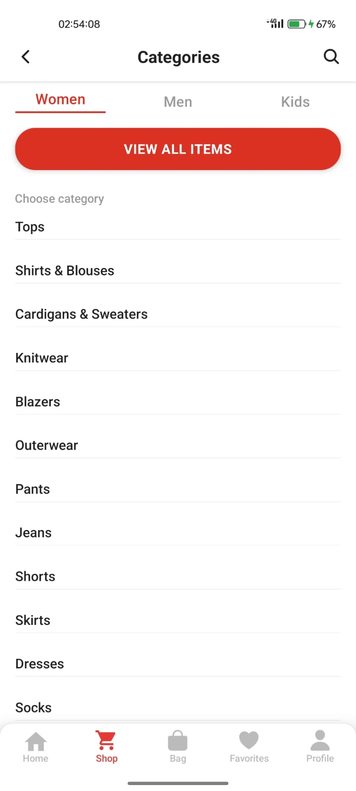

### Bag (Keranjang)
Menampilkan produk yang sudah ditambahkan ke keranjang. Pengguna dapat mengubah jumlah, menghapus produk, dan melanjutkan ke proses checkout.
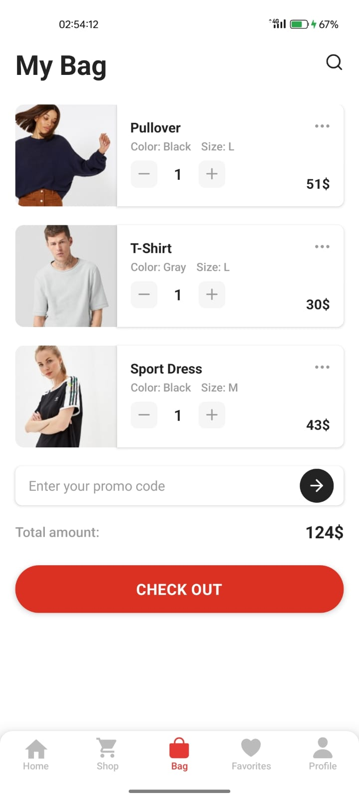

### Favorites (Wishlist)
Menampilkan produk favorit yang disimpan pengguna. Produk di sini dapat dipindahkan ke keranjang atau dihapus dari daftar favorit.
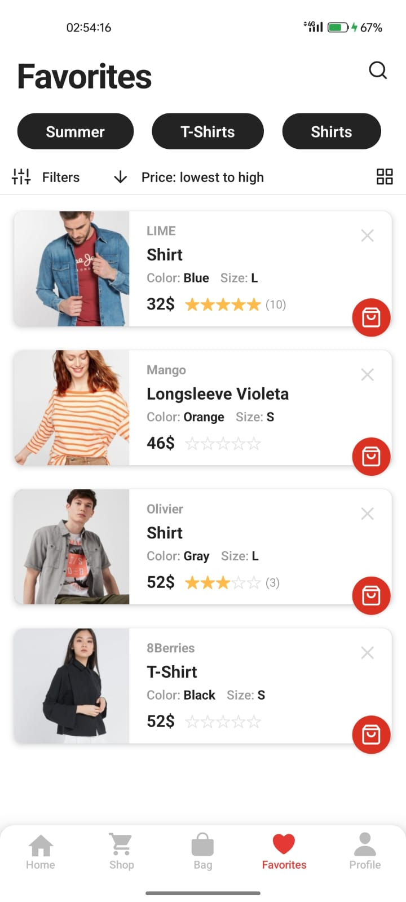

### Profile
Menampilkan info pengguna, avatar, email, dan menu navigasi seperti pesanan, alamat, metode pembayaran, promo, ulasan, dan pengaturan akun.
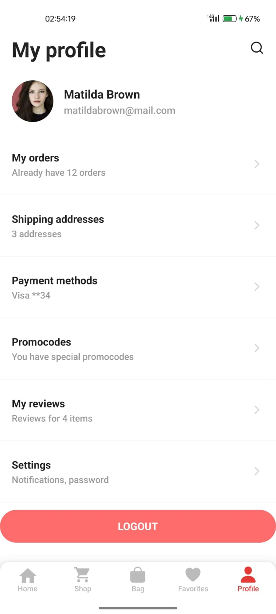

### Product Detail
Menampilkan detail produk: gambar, deskripsi, harga, rating, pilihan size dan warna, serta tombol untuk menambah ke keranjang. Gambar produk dapat digeser untuk melihat lebih detail.
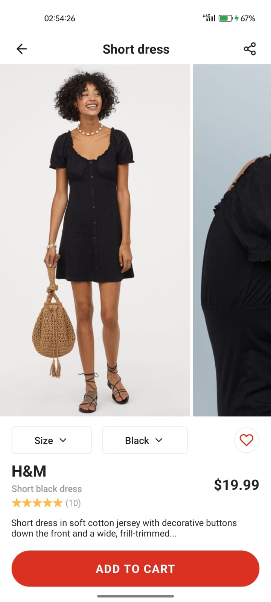  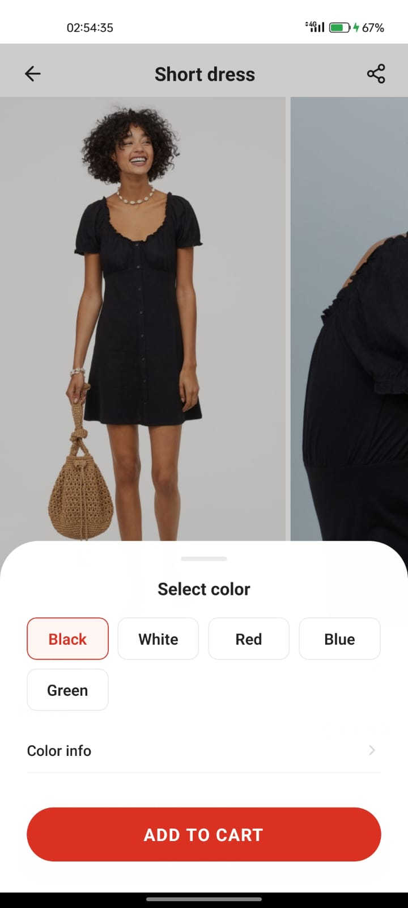


Aplikasi ini dapat dikembangkan lebih lanjut untuk integrasi backend, pembayaran online, dan fitur lain sesuai kebutuhan bisnis.
